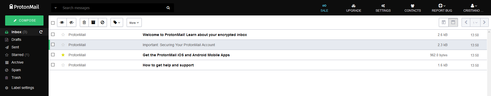

# ProtonMail Themes
Since [v1.16](https://blog.protonmail.ch/protonmail-beta-v1-16-release-notes/), the encrypted mail service now allows themes using the Cascading Style Sheets. You can pick a theme from the [Themes](Themes/) folder or create a custom one yourself using CSS. Feel free to [use the theme template provided](Themes/theme_template) as a starting point.

> These themes were developed for v3.7.3 of ProtonMail.
Themes still work up to version `v3.11.9` apart from a few  additional elements that need styling. (will fix soon)

### How to use a theme.
1. Pick one from the themes folder in the repository.
2. Select the theme and select the raw view to see all the code.
3. Select all and copy the code.
4. At ProtonMail's website head over to **Settings**, click the **Appearance** tab.
5. Paste the code under the *Custom Theme* section and press save.
> *In order to remove a theme, press clear.*

The theme should be applied and you should see the changes immediately.

### Available themes.
Check out some of the available themes you can choose from.

#### [Green Lume v3.7.3](Themes/green_lume/green_lume.min.css)

#### [Dark Bubble Gum v3.7.3](Themes/dark_bubble_gum/dark_bubble_gum.min.css)

#### [Blue and Orange v3.7.3](Themes/blue_and_orange/blue_and_orange.min.css)

### Feedback and fixes.
If you notice something's missing feel free to make a pull request. If you have no time to fix it please open an issue.
