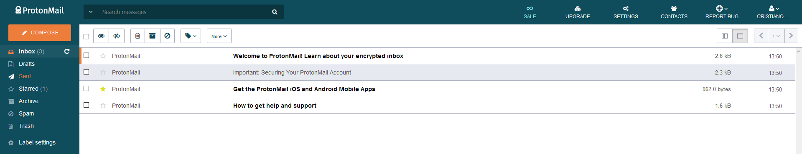

# ProtonMail Themes
Since [v1.16](https://blog.protonmail.ch/protonmail-beta-v1-16-release-notes/), the encrypted mail service allows the use of themes with Cascading Style Sheets. You can pick a theme from the [Themes](Themes/) folder or create a custom one yourself using CSS. Feel free to [use the theme template provided](Themes/theme_template) as a starting point.

> These themes were developed for **[v3.12.x](https://github.com/csalmeida/protonmail-themes/releases)** of ProtonMail.

### How to use a theme.
1. Pick one from the themes folder in the repository.
2. Select the theme and select the raw view to see all the code.
3. Select all and copy the code.
4. At ProtonMail's website head over to **Settings**, click the **Appearance** tab.
5. Paste the code under the *Custom Theme* section and press save.
> *In order to remove a theme, press clear.*

The theme should be applied and you should see the changes immediately.

### Available themes.
Check out some of the available themes you can choose from.

#### [Green Lume](Themes/green_lume/green_lume.css)

#### [Vitamin C](Themes/vitamin_c/vitamin_c.css)

#### [Dark Bubble Gum](Themes/dark_bubble_gum/dark_bubble_gum.min.css)

#### [Blue and Orange](Themes/blue_and_orange/blue_and_orange.min.css)

### Do these themes compromise security?
In short, no. All themes listed here will always style existing elements from ProtonMail's UI and not import any third party files from anywhere.
At the time I created these themes I've received a few directions from ProtonMail's co-founder [Jason Stockman](https://twitter.com/jasonstockman) in order to avoid breaking layout and security issues.

### Feedback and fixes.
If you notice something's missing feel free to make a pull request. If you have no time to fix it please open an issue.

#### Where can I find more themes?
* [ProtonMail's Official Themes](http://protonmail.tumblr.com/)
* [Austin Delamar's ProtonMail Themes](https://github.com/amdelamar/pm-theme)
* [Jérémie Cook's ProtonMail Theme](https://github.com/jeremiecook/protonmail-theme)

#### Web References
* [The Greenlume theme got featured on ProtonMail's website](https://protonmail.com/blog/protonmail-themes/)
