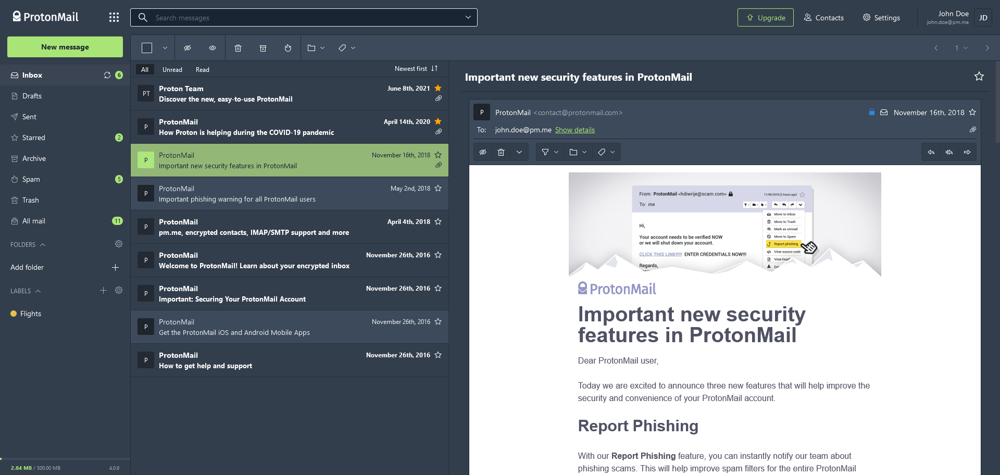
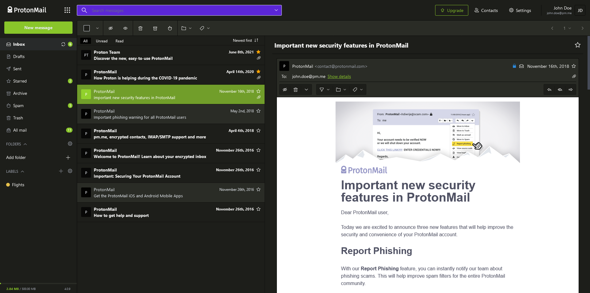
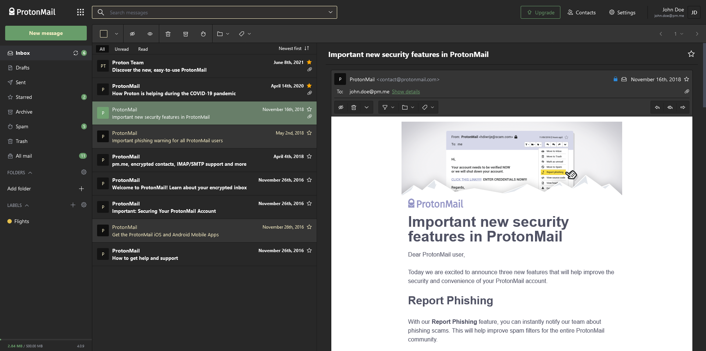

# ProtonMail Themes
Since [v1.16](https://blog.protonmail.ch/protonmail-beta-v1-16-release-notes/), the encrypted mail service allows the use of themes with Cascading Style Sheets. You can pick a theme from the [Themes](Themes/) folder or create a custom one yourself using CSS. Feel free to [use the theme template provided](templates/theme_example) as a starting point.

> These themes were developed for **[v4.0.x](https://github.com/csalmeida/protonmail-themes/releases)** of ProtonMail.

## Table of contents

<details>
<summary>Click to expand contents</summary>

- [How to use a theme](#how-to-use-a-theme)
- [Available themes](#available-themes)
  - [Do these themes compromise security?](#do-these-themes-compromise-security)
- [Quick setup guide](#quick-setup-guide)
- [Feedback and fixes](#feedback-and-fixes)
- [Contributors](#contributors)
- [Supporting and maintaining the project](#supporting-and-maintaining-the-project)
- [Where can I find more themes?](#where-can-i-find-more-themes)
- [Web References](#web-references)

#### Documentation 📖

- [Documentation](#documentation)
  - [Quick Setup Guide](#quick-setup-guide)
  - [Themes](#themes)
  - [Templates](#templates)
  - [Theme Compilation](#theme-compilation)
  - [Contributing](#contributing)
  - [Is there something missing?](#is-there-something-missing)
- [Project's README](../README.md)
- [Theme Template Guide](./theme-template-guide.md)
- [Theme Versioning](./theme-versioning.md)
</details>


### How to use a theme
1. Pick one from the themes folder in the repository.
1. Select the theme and select the raw view to see all the code.
1. Select all and copy the code.
1. At ProtonMail's website head over to **Settings**, click Themes under the **Appearance** section.
1. Paste the code under the *Custom Theme* section and press save.
> *In order to remove a theme, switch to default or remove Custom Theme contents and press save.*

The theme should be applied and you should see the changes immediately.

### Available themes
Check out some of the available themes you can choose from.

> There is also a `full` version available, that applies theme colors to the messages panel and more elements.

<details>
<summary><b>Expand theme list</b> 👩🏻‍🎨</summary>

#### [Green Lume](themes/green_lume)


#### [Vitamin C](themes/vitamin_c)


#### [Dark Bubble Gum](themes/dark_bubble_gum)


#### [Blue and Orange](themes/blue_and_orange)


#### [Ochin](themes/ochin)



#### [Dracula](themes/dracula)


#### [Monokai](themes/monokai)



#### [Deutera One](themes/deutera_one)


#### [Gruvbox](themes/gruvbox)



#### [Inbox](themes/inbox)

</details>

### Do these themes compromise security?
In short, no. All themes listed here will always style existing elements from ProtonMail's UI and not import any third party files from anywhere.
At the time I created these themes I've received a few directions from ProtonMail's co-founder [Jason Stockman](https://twitter.com/jasonstockman) in order to avoid breaking layout and security issues.

## Quick setup guide

> **Required for theme creation only**

Install [NodeJS](https://nodejs.org/en/), after forking/cloning this repository install dependencies:

```bash
cd protonmail-themes
# Requires Node v13.0.1, run `nvm use` to set the correct version. 
npm install
```

Themes can be created by duplicating and renaming the [example theme folder](templates/theme_example) and its `.scss` file to the theme name. Then edit that file by changing the color variables. You can also extend the theme by editing the `_styles.css` partial or by creating a custom one.

Two commands are available to compile themes:
```
*// Compiles themes as changes are made.*
npm run watch

*// Compiles all themes.*
npm run build
```

### Feedback and fixes
If you notice something's missing feel free to make a pull request. If you have no time to fix it please open an issue.

### Contributors
[](https://sourcerer.io/fame/csalmeida/csalmeida/protonmail-themes/links/0)[](https://sourcerer.io/fame/csalmeida/csalmeida/protonmail-themes/links/1)[](https://sourcerer.io/fame/csalmeida/csalmeida/protonmail-themes/links/2)[](https://sourcerer.io/fame/csalmeida/csalmeida/protonmail-themes/links/3)[](https://sourcerer.io/fame/csalmeida/csalmeida/protonmail-themes/links/4)[](https://sourcerer.io/fame/csalmeida/csalmeida/protonmail-themes/links/5)[](https://sourcerer.io/fame/csalmeida/csalmeida/protonmail-themes/links/6)[](https://sourcerer.io/fame/csalmeida/csalmeida/protonmail-themes/links/7)

### Supporting and maintaining the project
ProtonMail is a great email service, I enjoy working on the project and provide themes for all. Please consider making a small donation, just the price of a cup of coffee *goes a long way* to help me maintain it and keep adding color to your private email experience! Thank you 🙇🏻

<a href='https://www.paypal.me/csalmeida/5'>

</a>

#### Where can I find more themes?
* [ProtonMail's Official Themes](http://protonmail.tumblr.com/)
* [Austin Delamar's ProtonMail Themes](https://github.com/amdelamar/pm-theme)
* [Jérémie Cook's ProtonMail Theme](https://github.com/jeremiecook/protonmail-theme)
* [Quark, a theme creator for ProtonMail](https://github.com/csalmeida/quark)

#### Web References
* [The Greenlume theme got featured on ProtonMail's website](https://protonmail.com/blog/protonmail-themes/)
